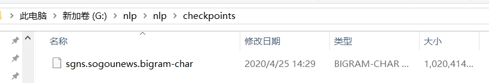

#操作步骤：

1、添加文件夹data、checkpoints  

2、下载数据，解压后将三个.csv直接放入到data文件夹下，连接地址：https://pan.baidu.com/s/1TprekQac-yzNHMsREWZe9g，Code: uhxt 

  

3、下载预训练词向量（链接：https://pan.baidu.com/s/1svFOwFBKnnlsqrF1t99Lnw），使用bunzip2 FileName.bz2解压该文件（windows下使用git bash解压，cmd解压不了）。  


  
4、运行train.py即可，参数调整在args.py,模型调整在model.py  

5、train完模型保存至output_dir文件夹下，词向量模型保存至data文件夹下  

#代码学习和调试

torchtext类是一个nlp领域文本预处理包，可以方便我们处理数据。  
train.py函数和中，通过tool.build_and_cache_dataset处理后返回的数据格式如下：  
`print(vars(train_dataset.examples[0]))`  
打印第一个数据，结果如下：
```{  
  'id': '6552376326253183492',   
  'category': 'news_agriculture',  
  'news': ['我国', '大量', '的', '进口', '的', '国外', '大豆', ',', '用到', '哪里', '去', '了', '呢', '?', '看', '完才', '明白', '!']  
}```