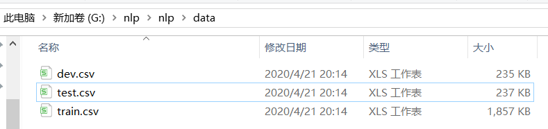

#操作步骤：

1、添加文件夹data、checkpoints  

2、下载数据，解压后将三个.csv直接放入到data文件夹下，连接地址：https://pan.baidu.com/s/1TprekQac-yzNHMsREWZe9g，Code: uhxt 

  

  

3、下载预训练词向量（链接：https://pan.baidu.com/s/1svFOwFBKnnlsqrF1t99Lnw），使用bunzip2 FileName.bz2解压该文件（windows下使用git bash解压，cmd解压不了）。  

  

4、新建output_dir文件夹以保存最优模型  

5、运行train.py即可，参数调整在args.py,模型调整在model.py  

6、train完模型保存至output_dir文件夹下，词向量模型保存至data文件夹下  

=====================================================================================  
2020/5/4 更新模型：将 LSTM 改成 双向GRU+attention机制,最高准确率达到84.52%